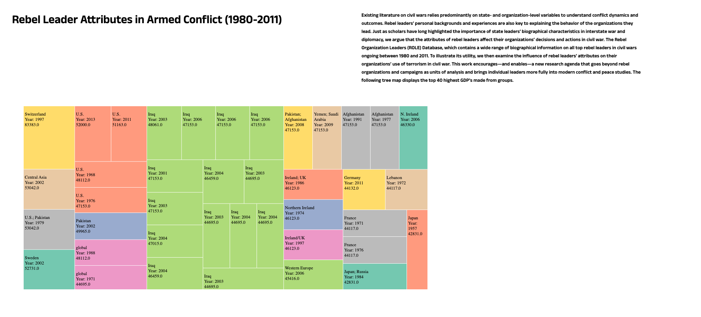

# Top 40 GDPs of Rebel Organization Leader(s) in Civil Wards between 1980 and 2011

ROLE is a database of rebel leader biographies, the first database of its kind. There is a wealth of data on the attributes, backgrounds, and experiences of state leaders in political science. This project is an exploratory analysis on how rebel leaders shape the dynamics of violent conflicts and contemporary world politics more broadly.

(Dataset Source)[https://www.rebelleaders.org/]

