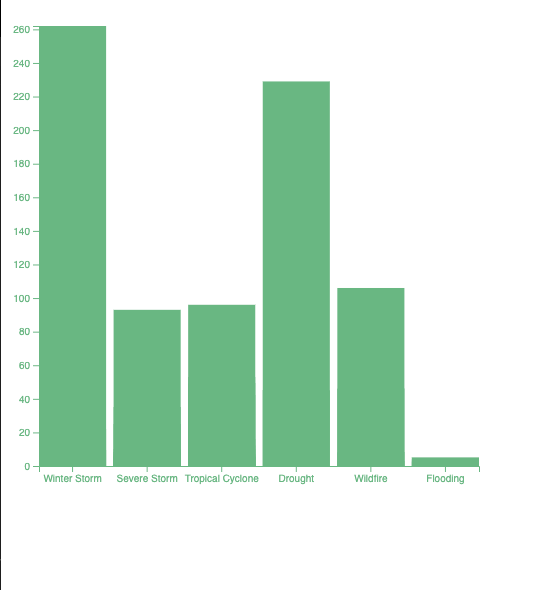

# Weather and Climate Billion-Dollar Disasters to affect the U.S. from 2018-2022 (CPI-Adjusted)

Source: (https://www.ncei.noaa.gov/access/billions/events/US/2021-2022?disasters[]=all-disasters)

In xScale, I imeplemented the scaleBand() function. For .domain I map the frequency values from Disasters (Winter Storm, Severe Storm, Tropical Cyclone, Drought, Wildfire, and Flooding). The attribute .range, is the charts width, creating a small gap between the bars. For yScale, I utilized scaleLinear() function. Using the attribute .domain to instantiate the minimum value 0 and maximum value existing in the feature Deaths. The total amount of deaths registered from the natural disaster.

