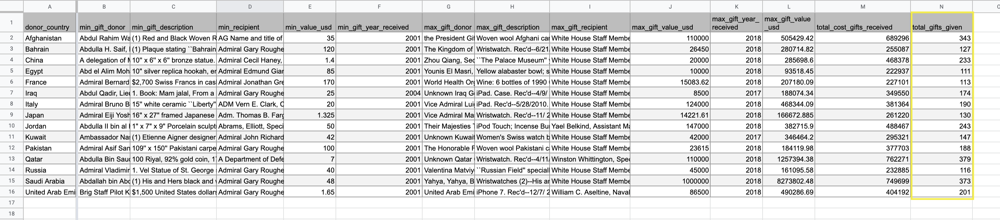
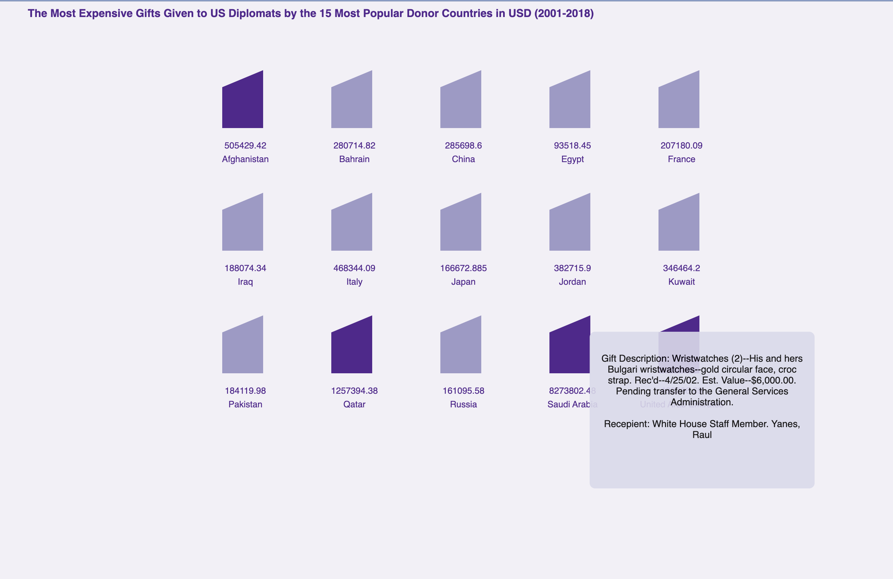

# The Most Expensive Gifts Given to US Diplomats by the 15 Most Popular Donor Countries in USD (2001-2018)

Source: (https://github.com/tacookson/data/tree/master/us-government-gifts)

This visualization demonstrates the highest gifts received by US Diplomates by the 15 most popular countries. I had to clean the data which you could find my jupyter file here (https://github.com/itzamnahuerta/ProgVisFA22/blob/main/week-5/hw-assignment/data%20cleaning.ipynb). I took the pivot table created into google sheets and removed the extra heading and included a new feature column called "total gifts given". Initally, I wanted to create a scale of the shape to indicate the number of total gifts a country has given a US Diplomate between 2001-2018 and color display the value of the gifts. Given the time constraint. I wasn't able to figure it out. 

